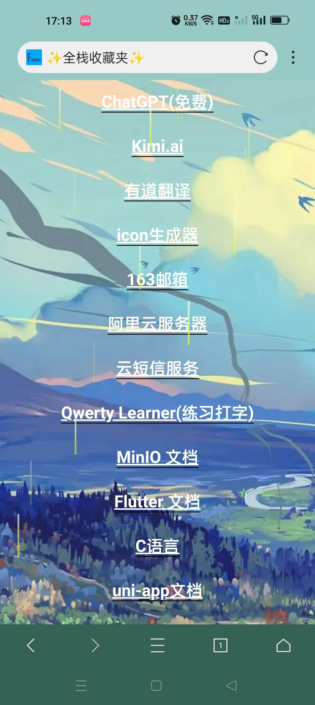

# Favorites个人收藏夹网页

### 项目展示

​	1. PC端

​	2.移动端

​		所有的收藏信息在[links.js](https://github.com/QiPanTanYi/Favorites/blob/main/links.js)中进行编辑排序，可以clone该仓库或者fork一份进行Github Pages搭建。

### 文件路径说明

	Favorites
	|
	├── Document	文档图片
	|
	├── image		素材存放点
	|
	├── common.css	通用CSS样式
	|
	├── index.html	网页入口
	|
	├── links.js	编辑收藏信息
	|
	├── raindrop.js	雨滴特效
	|
	└── README.md	说明文档

### 创建建议

​	首先，登录 GitHub 账号，在该仓库页面中点击页面右上角的 "Fork" 按钮，将该仓库 Fork 到你的 GitHub 账号下。进入你 Fork 后的仓库页面，在仓库上方点击 "Settings"。

​	在仓库设置页面中，向下滚动到 "GitHub Pages" 部分。在 "Source" 选项中选择 "master branch"（或者你想要托管的其他分支），然后点击 "Save" 保存设置。设置保存后，GitHub 会为你的仓库提供一个网址，你可以通过该网址访问你的网站。（比方说我这里是[qipantanyi.github.io/Favorites/](https://qipantanyi.github.io/Favorites/)）

​	在此声明，采用的素材均来自网络，该仓库采用MIT开源协议，如果你觉得不错，可以给个star噢！

